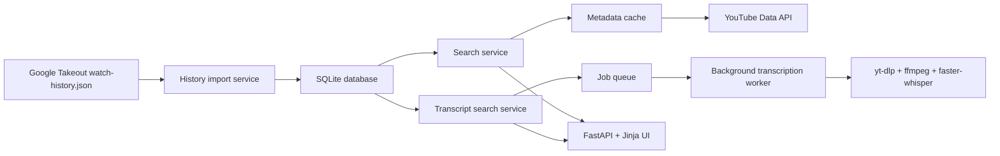

<div align="center">
  <h1>YouTube Video Finder</h1>
  <p>Local-first FastAPI app for exploring exported YouTube watch history with metadata enrichment and transcript-aware phrase search.</p>
  <p>
    <a href="https://github.com/SeeknnDestroy/video_finder/actions/workflows/ci.yml"></a>
    
    
    
  </p>
</div>

## Overview

YouTube Video Finder imports a Google Takeout `watch-history.json` export into a local SQLite database, then lets you search it through a small web UI.

The app is designed for personal, local analysis:

- import and deduplicate watched events by `(video_id, watched_at)`
- search by title keywords, date range, duration, and optional result limits
- enrich missing metadata from the YouTube Data API and cache it locally
- search transcript phrases and automatically queue missing transcript work
- transcribe locally with `yt-dlp`, `ffmpeg`, and `faster-whisper`

## Architecture



## Stack

| Layer | Choice | Notes |
| --- | --- | --- |
| App | FastAPI | Single-process local web app |
| Views | Jinja2 + CSS | Server-rendered UI, no frontend build step |
| Storage | SQLite | Watch history, metadata cache, transcript jobs |
| Metadata | YouTube Data API | Optional, only needed for enrichment |
| Transcription | `yt-dlp` + `faster-whisper` | Local pipeline, `ffmpeg` required |
| Tests | `pytest` | Service and route coverage |

## Quick Start

### Prerequisites

- Python 3.11 or newer
- `ffmpeg` on `PATH` if you want local transcription
- Optional: YouTube Data API key for metadata enrichment

### Installation

```bash
python -m venv .venv
source .venv/bin/activate
pip install -e ".[dev]"
cp .env.example .env
```

### Run the app

```bash
uvicorn app.main:app --reload
```

Then open [http://127.0.0.1:8000](http://127.0.0.1:8000), upload your Google Takeout `watch-history.json`, and start searching.

### Run the tests

```bash
pytest
```

You can also use the included `Makefile`:

```bash
make install
make run
make test
```

## Configuration

The app loads environment variables from `.env` automatically if the file exists in the current working directory.

| Variable | Default | Purpose |
| --- | --- | --- |
| `APP_DB_PATH` | `./data/video_finder.db` | SQLite database path |
| `YOUTUBE_API_KEY` | unset | Enables metadata enrichment for uncached videos |
| `LOG_LEVEL` | `INFO` | App logging level |
| `TRANSCRIBE_MODEL_SIZE` | `turbo` | Whisper model size |
| `TRANSCRIBE_LANGUAGE` | auto-detect | Optional fixed transcript language |
| `TRANSCRIBE_COMPUTE_TYPE` | `int8` | Whisper compute mode |
| `TRANSCRIBE_WORKER_CONCURRENCY` | `1` | Concurrent local transcription jobs |
| `TRANSCRIBE_JOB_MAX_CANDIDATES` | `200` | Max candidate videos per queued job |
| `TRANSCRIBE_WORKER_POLL_SECONDS` | `2` | Queue polling interval |
| `TRANSCRIBE_WORKER_ENABLED` | `true` | Starts the in-process worker on app startup |

## Search Capabilities

### Metadata-backed search

- title keyword matching with all-term semantics
- duration minimum and maximum filters
- date presets: `7d`, `30d`, `6m`, `1y`
- custom date ranges
- optional result limit up to 200

### Transcript phrase search

- uses transcript matches when they already exist locally
- auto-queues missing transcript work for candidate videos
- exposes queue/progress endpoints for background jobs
- may take longer on the first run while transcripts are prepared

## Project Layout

```text
app/
  core/        configuration, template helpers, static path helpers
  db/          SQLite connection and schema initialization
  models/      Pydantic request and response models
  routers/     FastAPI routes for search, import, and job status
  services/    import, search, metadata, transcription, job orchestration
  templates/   Jinja templates
  static/      CSS assets
  workers/     background transcription worker
tests/         route and service coverage
data/          local database path placeholder
```

## Operational Notes

- This repository intentionally ignores personal/local artifacts such as `.env`, SQLite database files, and raw `watch-history.json` exports.
- Without `YOUTUBE_API_KEY`, the app still works, but metadata-dependent filters may skip uncached videos.
- Local transcription requires `ffmpeg` and can be CPU-intensive depending on the selected Whisper model.
- The background worker runs inside the FastAPI process by default; disable it with `TRANSCRIBE_WORKER_ENABLED=false` if needed.

## CI

GitHub Actions runs the test suite on pushes to `main` and on pull requests against Python 3.11 and 3.12.
